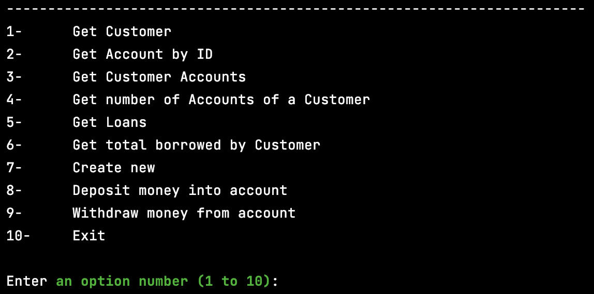
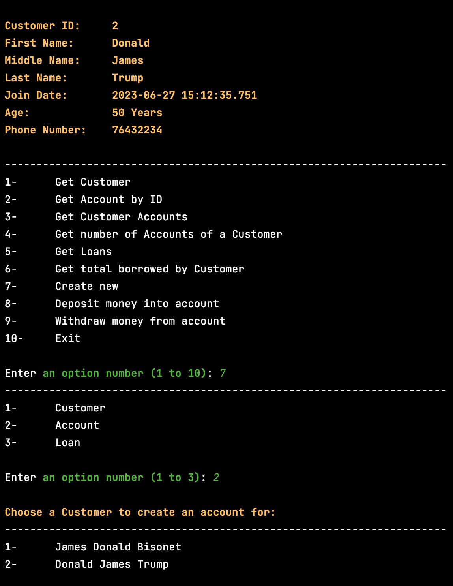
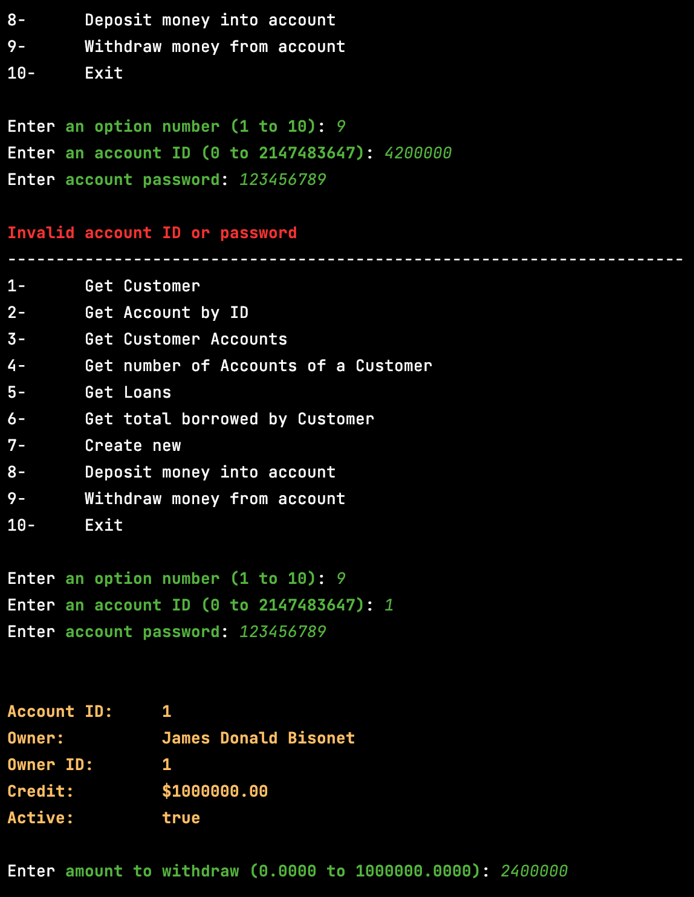

# MiniBank

MiniBank is a simple bank application built using Java, Spring Boot, and Hibernate. It provides basic functionality for managing customers, accounts, and loans. The application has a Command Line Interface (CLI) for user interaction.

## Features

- Customer Management: Allows creating, updating, and deleting customer information.
- Account Management: Supports account creation, updating account details, and closing accounts.
- Loan Management: Enables the creation, updating, and closing of loans.
- Transaction Tracking: Provides the ability to track transactions performed on accounts.

## Requirements

To run MiniBank, make sure you have the following requirements installed:

- Java Development Kit (JDK) 8 or later
- Apache Maven
- MySQL database

## Background

- This project was done as an assignment for the CSIS223 course.

## Demo

