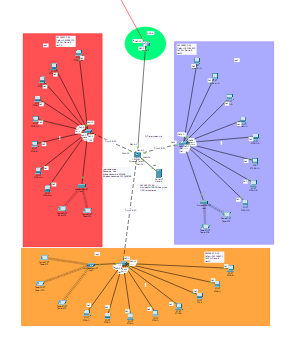
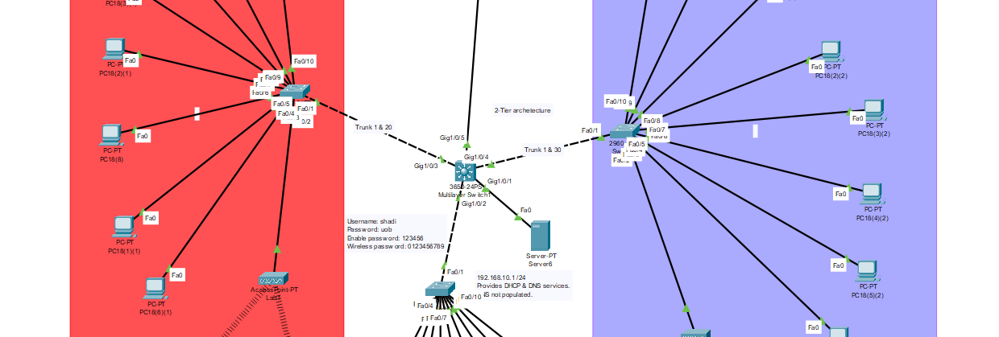
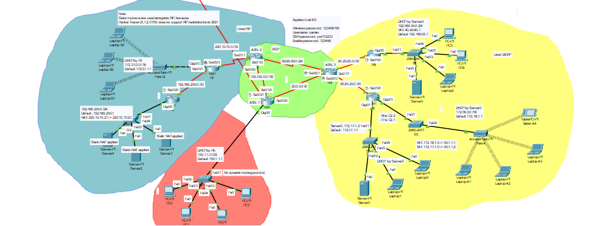

# Mininet

- This is the final project for the CSIS231 course
- The aim of this project is to demostrate the BGP protocol using Packet Tracer
- The project consists of two big networks, each of which is divided into subnetworks
- Public & private IPv4 address were used according to IANA standards
- The network is essentialy a simplified, tiny version of the internet
- Grade: _**100 / 100**_

## Installation

- Download & install Cisco Packet Tracer 8.2.1.0118 (Must use this exact version)

## Usage

- Open the [Network.pkt](Network.pkt) file using Packet Tracer 

## Features

### The network includes the following devices:
- PCs
- Tablets
- Switches
- Layer-3 Switches
- Routers
- Wireless Access Points
- Servers

### The network uses the following technologies:
- BGP
- EIGRP
- Static Routing
- DHCP Servers
- VLAN Routing
- NAT (Static, Dynamic, & Overloaded)
- IPv4 address only
- ACLs

## Screenshots

### Network 1
> 
> 
> 

### Network 2
> 
