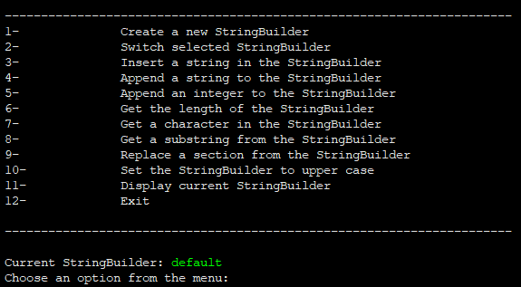

# University Course Projects

<!--  -->

Welcome to the University Course Projects repository! This repository contains a collection of projects completed as part of various university courses. Each project is designed to showcase different skills and concepts learned throughout the courses. 
Each project has a description in its respective file.

## Projects

### [C++ StringBuilder](StringBuilder)

A simplified implementation of Java's StringBuilder class in C++. This project allows you to efficiently create and manipulate strings without the overhead of repeatedly creating new string objects. It provides a command-line interface (CLI) that lets you interact with instances of StringBuilders. With built-in functions like creating new builders, inserting strings, appending integers, and more, you can easily create and modify strings to suit your needs.

### [Undo/Redo Stack of Actions](URStack)

Ever wished you could undo or redo your actions in a program? This project introduces an Undo/Redo stack implementation that allows you to manage a history of actions and navigate through them effortlessly. Whether you're working on a text editor, graphic design software, or any application where user actions need to be tracked, the Undo/Redo Stack of Actions project provides a solid foundation for implementing this essential feature.

### [Mininet](Mininet)

Delve into the realm of computer networks with this project that focuses on configuring networks using Cisco Packet Tracer. In this hands-on project, you will design, simulate, and configure a network topology using Cisco Packet Tracer, a powerful network simulation tool. Explore various networking concepts, configure routers, switches, and other network devices, and gain a deeper understanding of how network protocols and configurations work together to establish communication.

## Getting Started

To get started with any of the projects in this repository, follow the installation and usage instructions provided in the respective project directories.

## Acknowledgments

We would like to express our gratitude to the professors and instructors who guided us throughout the courses and provided valuable insights and knowledge. Their expertise and dedication greatly contributed to the development of these projects.

