# C++ StringBuilder

## Details

- This project aims at mimicing some of the functionality provided by Java's StringBuilder class

- The MyStringBuilder class is basically an encapsulated linked list, where each node stores a single character of the string

- The program must provide a CLI to test each public function of the MyStringBuilder class

- The project represents 15% of the course grade

- Must use C++17 or newer

-  Grade: **_95 / 100_**

## Features

- Efficient string manipulation
- Good-looking CLI
- User can create multiple instances of StringBuilders
- The StringBuilders can be manipulated in many ways
- Informs the user of invalid input

## Example Run

> 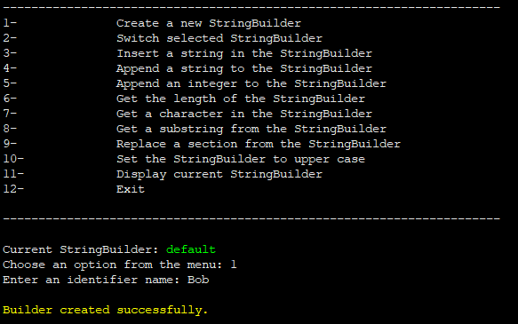
> 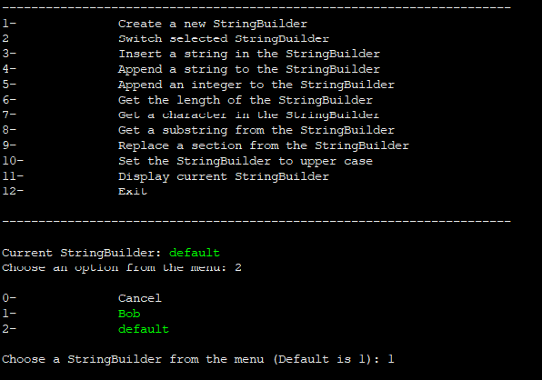
> 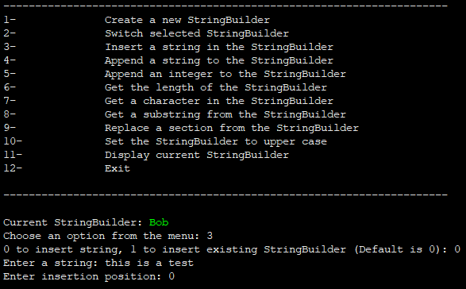
> 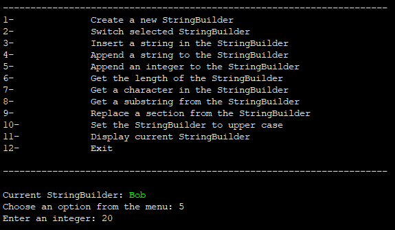
> 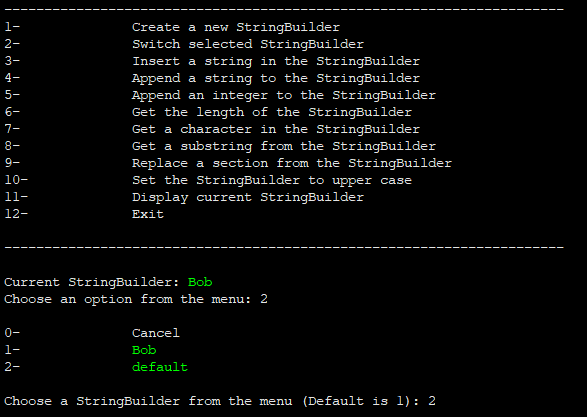
> 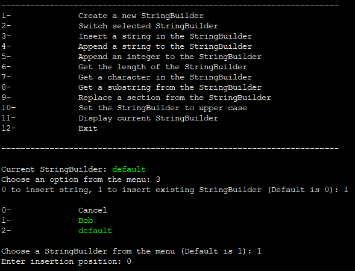
> 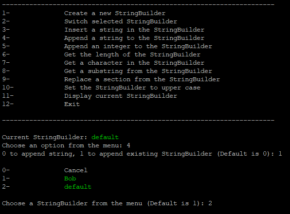
> 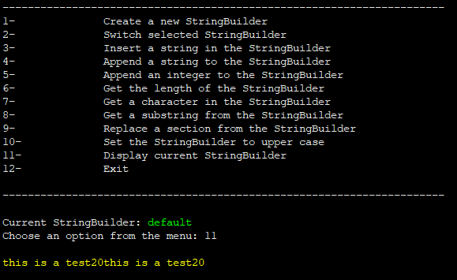
> 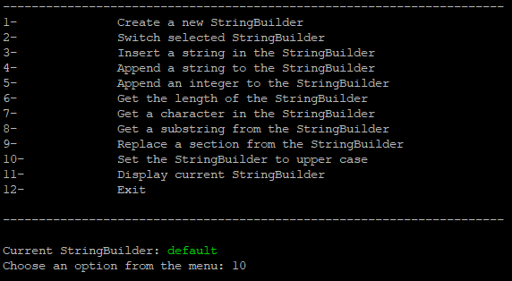
> 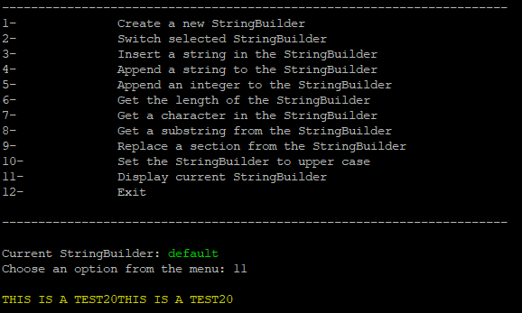
> 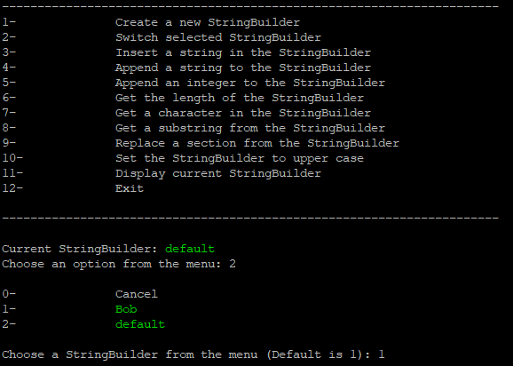
> 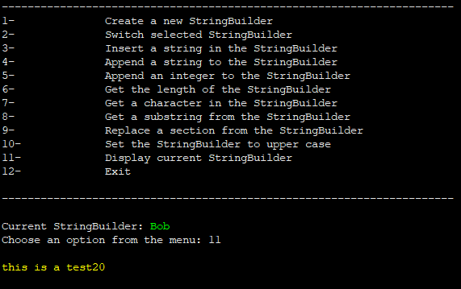
