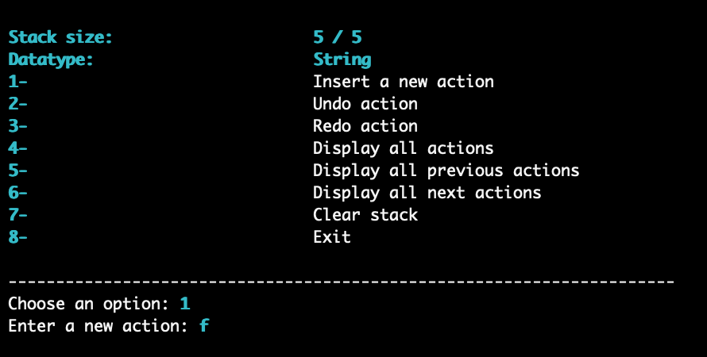

# Undo/Redo Stack

## Details

- This project aims at making an undo/redo stack similar to the Windows actions stack

- The URStack class is a basically an encapsulated stack with some added functionality 

- The program must provide a CLI to test each public function of the URStack class

- The program must use single linked nodes & must be generic

- The project represents 20% of the course grade

- Must use C++17 or newer

- Grade: **_95 / 100_**

## Features

- Efficient nodes manipulation
- Good-looking CLI
- Somewhat interactive
- Informs the user of invalid input

## Example Run

> 
> 
> 
> 
> 
> 
> 
> 
> 
> 
> 
> 
> 
> 
> 
> 
> 
> 
> 
> 
> 
> 
> 
> 
> 
> 
> 
> 
> 
> 
> 
